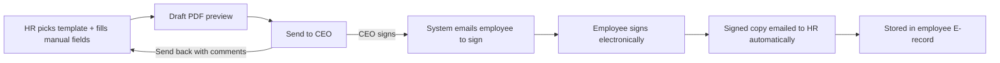
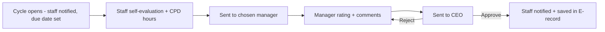
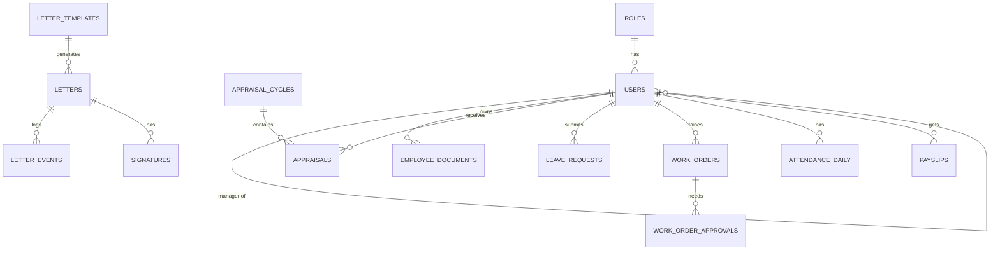

# BNW OMS — Project Guide

**HR & Operations Management System** · React + MUI (frontend) · Node.js + Express (backend) · **PostgreSQL** (database, managed via pgAdmin)

> Built from two source documents: `OMS_Software_guide.xlsx` (module list + workflow details) and `BNW_meeting.txt` (Phase 1 meeting notes). Where the two differ, or a note was unclear, it is flagged in **Section 12 (Open Questions)**.

---

## Table of Contents

0. [Start Here — What To Do First](#0-start-here--what-to-do-first)
1. [Project Summary](#1-project-summary)
2. [Decisions To Confirm Before Coding](#2-decisions-to-confirm-before-coding)
3. [Consolidated Requirements](#3-consolidated-requirements)
4. [Roles & Permissions](#4-roles--permissions)
5. [Key Workflows](#5-key-workflows)
6. [Tech Stack](#6-tech-stack)
7. [Architecture & Folder Structure](#7-architecture--folder-structure)
8. [Database Design](#8-database-design)
9. [API Design](#9-api-design)
10. [Step-by-Step: Create & Start the Project](#10-step-by-step-create--start-the-project)
11. [Build Roadmap](#11-build-roadmap)
12. [Open Questions For The Client](#12-open-questions-for-the-client)
13. [Standards, Security & Testing](#13-standards-security--testing)

---

## 0. Start Here — What To Do First

Do these in order. Days 1–2 are mostly *decisions and setup*; you write real code from step 6.

| # | Action | Why it comes first |
|---|--------|--------------------|
| 1 | ~~Fix the database choice~~ **Decided: PostgreSQL 16, managed with pgAdmin** (see §2.1). | Driver, Docker image and admin tool are now fixed. |
| 2 | **Send the client the "Blocker" questions in §12** and ask for **sample files**: every letter template (offer, contract, warning…), a sample export from the biometric device, an example payslip, the appraisal form questions. | The letter engine, attendance import and appraisal form can't be designed without them. Waiting time is free time — send this on day 1. |
| 3 | Install tools: Node.js LTS, Git, VS Code, Docker Desktop, **pgAdmin** (or DBeaver), Postman/Thunder Client. | — |
| 4 | Create the repo and folder skeleton (§10.1). | One monorepo: `client/`, `server/`, `docs/`. |
| 5 | Start PostgreSQL with Docker (§10.2) and connect pgAdmin to it. | Gives every dev the same DB in one command. |
| 6 | **Backend skeleton**: Express app, `/api/v1/health`, DB connection, migrations set up (§10.3–10.4). | Proves Node ↔ PostgreSQL works. |
| 7 | **Frontend skeleton**: Vite + React + MUI theme + router + layout (§10.5). | Proves React ↔ API works through the dev proxy. |
| 8 | **First vertical slice: Login → JWT → role-based dashboard → Users CRUD.** | Everything else (appraisals, letters, leave…) depends on users, roles and the manager hierarchy. |

**Golden rule:** build one *vertical slice* at a time (migration → model → API → React page → test) rather than all the backend first, then all the frontend.

**Definition of "project started":** you can log in as `admin@bnw.local`, see a dashboard in the MUI theme, create an employee with a role and a manager, and see that row in pgAdmin.

### 0.1 How we'll work through this in Claude

We'll go **sprint by sprint, exactly as listed in §11**, and inside each sprint **module by module / vertical slice by vertical slice** (§10.6's loop: migration → model → API → React page → test). Concretely, each work session looks like:

1. You tell me which sprint/module we're on (or just say "next").
2. I generate the actual files for that slice (migration, model, controller/route, React page/component) directly in this workspace, matching the conventions already fixed in this guide (Sequelize + Postgres, `snake_case` DB columns, `{ data }` / `{ error }` API shape, JWT + RBAC).
3. You run it locally (`docker compose up -d`, `npm run dev` in `server/` and `client/`) and hit the ✅ checkpoint for that step.
4. We fix anything that breaks, then move to the next slice.

**Suggested order to start (maps to §11):**

| Phase | Sprint | What we build |
|:-:|:-:|---|
| 1 | Sprint 0 | Repo skeleton, Docker Postgres, Express + Vite skeletons, MUI theme, first migration/seed |
| 2 | Sprint 1 | Auth (login/refresh/logout), roles + RBAC middleware, Users CRUD, manager assignment, dashboard layout |
| 3 | Sprint 2 | E-record documents, CEO staff-summary table |
| 4 | Sprint 3 | Letter engine (offer letter first) |
| ... | ... | rest of §11, in order |

Tell me to start **Phase 1 / Sprint 0** and I'll generate the repo skeleton and Docker/Postgres setup files now.

---

## 1. Project Summary

An internal web portal that digitises BNW's HR and operations paperwork:

- **Employees** get a dashboard: appraisals, leave, payslips, announcements, requests, daily activity log.
- **Managers** approve leave/requests and write appraisals for their team.
- **HR** prepares letters and contracts, manages employee records, imports attendance.
- **CEO** reviews/signs letters and contracts, approves appraisals, sees a one-window staff summary.
- **Payroll** receives a monthly summary of financial claims.

Central idea: each employee has an **E-record** (electronic file) where every CV, signed letter, contract, appraisal and supporting document ends up automatically.

**Scope:** "Phase 1" in the meeting notes covers everything listed in §3, which is large. §11 splits it into sprints so you always have something working.

---

## 2. Decisions To Confirm Before Coding

### 2.1 Database: PostgreSQL (decided)

**pgAdmin is the admin tool for PostgreSQL, not MySQL** — that mismatch in the original meeting notes is now resolved:

| | Database | Admin tool | Node driver |
|--|----------|------------|-------------|
| **Chosen** | PostgreSQL 16 | pgAdmin (or DBeaver, which works with either) | `pg`, `pg-hstore` |
| *(not used)* | ~~MySQL 8.x~~ | ~~MySQL Workbench~~ | ~~`mysql2`~~ |

This guide uses Sequelize (an ORM), so every code sample below (Docker image, `.env`, `dialect`, migrations, models) is already written for PostgreSQL. A couple of Postgres-specific things to keep in mind as you build:

- **No `INTEGER.UNSIGNED`.** Postgres doesn't have unsigned integers — primary/foreign keys are just `Sequelize.INTEGER` with `autoIncrement: true` (Sequelize creates a `SERIAL` column under the hood).
- **ENUMs are real Postgres types.** Sequelize creates a native `CREATE TYPE ... AS ENUM (...)` for each `DataTypes.ENUM(...)` column. If you ever change the allowed values, you'll need a migration that alters the type (`ALTER TYPE ... ADD VALUE`), not just a column edit.
- **JSON columns:** use `DataTypes.JSONB` (not plain `JSON`) for `fields_schema`, `field_values`, `allowances`, `before`/`after`, etc. — `JSONB` is indexable and faster to query in Postgres.
- **Case sensitivity:** Postgres lower-cases unquoted identifiers. Sticking to `snake_case` table/column names (as this guide already does) avoids quoting headaches.

### 2.2 Other decisions (recommended defaults)

| Topic | Recommendation | Reason |
|-------|----------------|--------|
| Language | JavaScript first; TypeScript optional | Faster to start. Add TS later if the team wants. |
| React tooling | **Vite** (not Create React App) | CRA is deprecated. |
| ORM / migrations | **Sequelize v6 + sequelize-cli** | Mature, works great with PostgreSQL, migrations included. |
| Auth | JWT access token + refresh token in httpOnly cookie | Standard, secure enough for an internal portal. |
| Letter/contract generation | HTML templates with `{{placeholders}}` → PDF | Matches "set template with some fields manually input". |
| E-signature | Build a simple in-app signature first (drawn/typed signature + timestamp + IP + document hash), behind a `signatureService` interface | Meeting notes mention "paid" e-sign; if the client wants DocuSign / Dropbox Sign later, only that service changes. Check legal validity with the client's legal advisor. |
| File storage | Local disk in dev (`server/uploads/`), S3-compatible later | Store only paths + metadata in the DB. |
| Email | Nodemailer + SMTP (Gmail/Outlook/SendGrid) | Needed for announcements, reminders, signed-letter copies. |
| Scheduled jobs | `node-cron` | Appraisal reminders, quarterly cycle creation. |

---

## 3. Consolidated Requirements

Source key: **G** = Excel guide, **M** = meeting notes. Items in only one source are marked so nothing is missed.

### 3.1 User Management

| ID | Requirement | Src | Notes |
|----|-------------|-----|-------|
| U1 | User accounts with roles and a reporting manager | M | Foundation for every approval flow. |
| U2 | Long user/staff form ("34–40 form fill") | M | **Unclear** — see §12. Could be the employee profile form (~34–40 fields) or the appraisal form. |
| U3 | Daily activity log for employees | G, M | Two possible meanings: employee-entered daily work log, and/or system audit log. Build both (cheap). |
| U4 | Staff Database summary for CEO — key info of all employees in one window | G | Searchable/filterable table + export. |
| U5 | Employee **E-record**: CVs, letters, contracts, approved appraisals are auto-retained | G | Central document repository per employee. |

### 3.2 Appraisals

| ID | Requirement | Src |
|----|-------------|-----|
| A1 | Staff **self-evaluation form**, notified at a **set frequency** (quarterly) with a **completion date** | G, M |
| A2 | Sent to the **chosen manager** | G, M |
| A3 | Manager appraisal with **rating + comment box** | G, M |
| A4 | Sent to **CEO** → **approve or reject** | G, M |
| A5 | Approved result is **notified to staff** and **saved in E-record** | G |
| A6 | "Two-way process" — staff and manager both contribute | G |
| A7 | **CPD hours** (Continuing Professional Development) tracked | G only |

### 3.3 Hiring & Contracts (Letter Engine)

| ID | Requirement | Src |
|----|-------------|-----|
| H1 | **Bulk upload of CVs**; retained in E-record | M, G |
| H2 | **Offer letter** generated from a set template, based on **role**; some fields typed manually | G, M |
| H3 | Preparer (HR) → **CEO** for review and signing; **CEO can send back with suggestions/changes** | G |
| H4 | After CEO signs, system **emails the letter to the employee** for e-signing | G, M |
| H5 | **Signed copy returns to HR by email automatically** | G, M ("email … auto") |
| H6 | **Contract**: same template + CEO review/sign + send-to-employee flow | G, M |
| H7 | With the contract, employee is asked for documents; HR picks applicable ones from a **dropdown** (photo ID, ID card, experience certificate, degrees…) | G only |
| H8 | **Joining pack** sent **for review only**: Operating guide, Team intro, Policy notes | G only |
| H9 | Templates for: **Redundancy letter**, **Change of contract terms letter**, **Warning letters** | G, M |
| H10 | Supporting docs (attached to hiring records) | G only |

### 3.4 HR Self-Service

| ID | Requirement | Src |
|----|-------------|-----|
| R1 | **Leave / holiday request** → manager approval | G, M |
| R2 | **Holiday record** (history + balances) | G only |
| R3 | **Grievance form, Complaint box, Suggestion box** | G, M |
| R4 | **Announcement board** on every dashboard **+ email notification** | G, M |
| R5 | **Payslips** — employee can generate them directly from their dashboard | G, M |
| R6 | **Experience letters** from a template | G, M |

### 3.5 Work Orders

| ID | Requirement | Src |
|----|-------------|-----|
| W1 | **Reimbursement requests** with approval | G, M |
| W2 | **Equipment replacement/repair requests** | G only |
| W3 | Financial requests produce a **monthly claims summary for payroll** | G only |
| W4 | "Approval for anything" — generic approvable request type | M only |

### 3.6 Attendance

| ID | Requirement | Src |
|----|-------------|-----|
| T1 | Company has a **biometric device**. **Upload its report**; system analyses it and adds results to employee database & dashboard | G (upload), M ("integrate") |

> The guide says *upload a report*; the meeting note says *integrate*. This guide plans **file upload for Phase 1**, with a design that can accept live device data later. Confirm in §12.

---

## 4. Roles & Permissions

| Role | Description |
|------|-------------|
| `EMPLOYEE` | Every staff member. Sees only their own data. |
| `MANAGER` | An employee with direct reports (via `manager_id`). Approves their team's leave/requests, writes appraisals. |
| `HR` | Prepares letters, manages employee records, imports attendance, posts announcements. |
| `CEO` | Reviews/signs letters, approves appraisals, sees the staff summary. |
| `PAYROLL` | Sees monthly claims summary, manages payslip data. |
| `ADMIN` | System settings, user/role management, templates. |

> A user has **one role plus a manager link**. "Manager" can be derived (has reports) or set as a role — pick one and keep it consistent.

| Feature | Employee | Manager | HR | CEO | Payroll | Admin |
|---------|:-:|:-:|:-:|:-:|:-:|:-:|
| Own profile / E-record | ✔ | ✔ | ✔ | ✔ | ✔ | ✔ |
| All employees' E-records | – | Team | ✔ | ✔ | – | ✔ |
| Submit self-appraisal | ✔ | ✔ | ✔ | – | ✔ | – |
| Manager appraisal | – | Team | – | – | – | – |
| Approve/reject appraisal | – | – | – | ✔ | – | – |
| Prepare letters/contracts | – | – | ✔ | – | – | ✔ |
| Review/sign letters | – | – | – | ✔ | – | – |
| Apply for leave | ✔ | ✔ | ✔ | ✔ | ✔ | ✔ |
| Approve leave | – | Team | – | (optional) | – | – |
| Grievance/complaint/suggestion – submit | ✔ | ✔ | ✔ | ✔ | ✔ | ✔ |
| Grievance/complaint – read & respond | – | – | ✔ | ✔ | – | – |
| Post announcements | – | – | ✔ | ✔ | – | ✔ |
| Generate own payslip | ✔ | ✔ | ✔ | ✔ | ✔ | ✔ |
| Manage payslip/salary data | – | – | – | – | ✔ | – |
| Reimbursement / equipment request | ✔ | ✔ | ✔ | ✔ | ✔ | ✔ |
| Monthly claims summary | – | – | – | ✔ | ✔ | – |
| Import attendance | – | – | ✔ | – | – | ✔ |
| Staff summary (all employees) | – | – | ✔ | ✔ | – | ✔ |
| Audit log | – | – | – | ✔ | – | ✔ |

Enforce this **on the backend** with a `requireRole(...)` middleware plus ownership checks (e.g. "manager of this employee"). Hiding buttons in React is only for UX.

---

## 5. Key Workflows

### 5.1 Letters & Contracts (offer, contract, redundancy, terms change, warning, experience)

One generic engine handles all six letter types; only the template differs.



**Statuses:** `DRAFT → PENDING_CEO → CHANGES_REQUESTED → CEO_SIGNED → SENT_TO_EMPLOYEE → SIGNED → ARCHIVED` (plus `CANCELLED`).

**Template design:** each template stores HTML with placeholders and a `fields_schema` JSON:
- *Auto fields* filled from the employee record (`{{employee.full_name}}`, `{{employee.designation}}`, `{{company.name}}`).
- *Manual fields* HR types in (`{{salary}}`, `{{start_date}}`, `{{warning_reason}}`).

**Contract extras (H7, H8):** when a contract is sent, also create (a) an HR-selected **document request checklist** from the dropdown list, and (b) the **joining pack** (operating guide, team intro, policy notes) as *review-only* items with an "I have read this" acknowledgement.

### 5.2 Appraisal (quarterly)



**Statuses:** `NOTIFIED → SELF_SUBMITTED → MANAGER_REVIEWED → CEO_APPROVED | CEO_REJECTED`.
*Assumption:* a CEO rejection returns to the manager with a comment — confirm in §12.

### 5.3 Leave / Holiday
`PENDING → APPROVED | REJECTED | CANCELLED`. Applies to the employee's manager. Approved leave updates the **holiday record** (balance and history) and later feeds attendance ("on leave" instead of "absent").

### 5.4 Work Orders (reimbursement, equipment, other)
`SUBMITTED → MANAGER_APPROVED → FINANCE/HR_APPROVED → PAID/COMPLETED` (or `REJECTED`). Financial types roll into a **monthly claims summary** for payroll. Approval chain per type is configurable (confirm in §12).

### 5.5 Attendance Import
HR uploads the device report → system parses rows → maps device user IDs to employees → computes daily status (present / late / absent / half-day / on leave) → shows on the employee dashboard and staff database.

### 5.6 Announcements
HR/CEO posts → appears on every dashboard → email sent to all (or selected departments) → read receipts optional.

---
## 6. Tech Stack

### Frontend (`client/`)

| Purpose | Package |
|---------|---------|
| Build tool / framework | **Vite + React** |
| UI library / theme | **MUI** (`@mui/material`, `@emotion/react`, `@emotion/styled`, `@mui/icons-material`) — **minimal-style theme**: palette/typography/shadows/overrides split, soft elevation, rounded corners, collapsible sidebar layout (see §7 `theme/` and §10.5) |
| Data tables | `@mui/x-data-grid` |
| Date pickers | `@mui/x-date-pickers` + `dayjs` |
| Routing | `react-router-dom` |
| Server state (API calls, caching) | `@tanstack/react-query` |
| HTTP | `axios` |
| Forms + validation | `react-hook-form`, `zod`, `@hookform/resolvers` |
| Toasts | `notistack` |
| Font | `@fontsource/roboto` (or swap for `@fontsource/inter` / `@fontsource/public-sans` — both are common in minimal-style MUI themes and read cleaner at small sizes) |
| Scrollbars (optional, matches minimal-kit feel) | `simplebar-react` |
| Install later, when needed | `react-signature-canvas` (e-sign pad), a rich-text editor such as TipTap (template editor), `recharts` (dashboard charts) |

### Backend (`server/`)

| Purpose | Package |
|---------|---------|
| Runtime / framework | **Node.js LTS + Express** |
| ORM + migrations | `sequelize`, `pg`, `pg-hstore`, dev: `sequelize-cli` |
| Config | `dotenv` |
| Security | `helmet`, `cors`, `express-rate-limit`, `bcryptjs`, `jsonwebtoken`, `cookie-parser` |
| Validation | `zod` |
| File upload | `multer` |
| Email | `nodemailer` |
| Scheduled jobs | `node-cron` |
| Logging | `morgan` (HTTP), `winston` or `pino` (app) |
| Letters → PDF | `handlebars` (fill placeholders) + `puppeteer` (HTML → PDF); `pdf-lib` to stamp signatures |
| Attendance import | `papaparse` (CSV), `exceljs` (Excel) |
| Dev / test | `nodemon`, `jest`, `supertest`, `eslint`, `prettier` |

---

## 7. Architecture & Folder Structure

```
Browser (React + MUI)
      │  /api/v1/*  (Vite proxy in dev)
      ▼
Express API ── auth → RBAC → validation → controller → service → Sequelize ──► PostgreSQL
      │
      ├── File storage (uploads/)      CVs, signed PDFs, attachments
      ├── Mail service (SMTP)          notifications, signed copies
      ├── PDF service                  template → PDF
      ├── Signature service            in-app now, swappable later
      └── Cron jobs                    appraisal cycles, reminders
```

### Monorepo layout

```
bnw-oms/
├── docker-compose.yml
├── README.md
├── docs/                       # this guide, client samples, decisions
├── client/                     # React + Vite + MUI
│   ├── index.html
│   ├── vite.config.js
│   └── src/
│       ├── main.jsx
│       ├── App.jsx
│       ├── api/                # axios instance + per-module API functions
│       ├── theme/              # minimal-style MUI theme, split by concern
│       │   ├── index.jsx           # ThemeProvider wrapper (composes the pieces below)
│       │   ├── palette.js          # colors (primary/secondary/grey/status), light + dark
│       │   ├── typography.js       # font family, scale, weights
│       │   ├── shadows.js          # soft, layered custom shadow scale
│       │   ├── shape.js            # border radius tokens
│       │   └── overrides/          # per-component style overrides (Button, Card, AppBar, Drawer…)
│       ├── layouts/            # AuthLayout, DashboardLayout
│       │   └── dashboard/
│       │       ├── DashboardLayout.jsx   # AppBar + collapsible Drawer + <Outlet/>
│       │       ├── Header.jsx            # top bar: collapse toggle, search, notifications, account menu
│       │       ├── Sidebar.jsx           # nav rendered from nav-config, active-route highlight
│       │       └── nav-config.js         # [{ title, path, icon, roles }] — one entry per module
│       ├── routes/             # router, ProtectedRoute, role guards
│       ├── components/         # shared: DataTable, ConfirmDialog, StatusChip, FileUpload
│       ├── hooks/
│       ├── utils/
│       └── features/           # one folder per module
│           ├── auth/
│           ├── users/
│           ├── employees/      # E-record, staff summary
│           ├── appraisals/
│           ├── hiring/         # CV upload, candidates
│           ├── letters/        # templates, letter workflow, e-sign
│           ├── leave/
│           ├── feedback/       # grievance, complaint, suggestion
│           ├── announcements/
│           ├── payslips/
│           ├── workorders/
│           ├── attendance/
│           └── activity/
└── server/
    ├── .env  /  .env.example
    ├── .sequelizerc
    ├── uploads/                # git-ignored
    └── src/
        ├── server.js           # starts the server
        ├── app.js              # express app + middleware
        ├── config/             # db.js, sequelize-cli.js, env
        ├── migrations/
        ├── seeders/
        ├── models/             # Sequelize models + index.js (associations)
        ├── middleware/         # auth.js, rbac.js, validate.js, upload.js, error.js, audit.js
        ├── services/           # mail, pdf, signature, storage, notification
        ├── jobs/               # cron jobs
        ├── utils/
        └── modules/            # one folder per module
            └── <module>/       # routes.js, controller.js, service.js, schema.js (zod)
```

**Layer rule:** *routes* → *controller* (HTTP only) → *service* (business rules, DB) → *models*. Keep approval/status logic in services so it can be unit-tested.

---

## 8. Database Design

Conventions: `snake_case`, `id` = unsigned INT/BIGINT auto-increment, `created_at` / `updated_at` everywhere, soft delete (`deleted_at`) for people and documents, **store all timestamps in UTC**, use `ENUM` (or a lookup table) for statuses.

### 8.1 Tables by module

**Core & users**
| Table | Key columns |
|-------|-------------|
| `roles` | id, name (`EMPLOYEE`, `MANAGER`, `HR`, `CEO`, `PAYROLL`, `ADMIN`) |
| `departments` | id, name |
| `users` | id, employee_code, first_name, last_name, email (unique), password_hash, role_id, **manager_id (self-FK)**, department_id, designation, status (`ONBOARDING/ACTIVE/INACTIVE`), join_date, must_change_password |
| `employee_profiles` | user_id, phone, address, DOB, gender, emergency contact, national ID, bank details… (the "34–40 field" form if that is what it means) |
| `refresh_tokens` | id, user_id, token_hash, expires_at, revoked_at |
| `notifications` | id, user_id, type, title, body, link, read_at |

**E-record & documents**
| Table | Key columns |
|-------|-------------|
| `document_types` | id, name — feeds the HR dropdown (Photo ID, ID card, Experience certificate, Degree…) |
| `employee_documents` | id, user_id, document_type_id, file_path, original_name, mime, size, source (`UPLOAD/LETTER/CONTRACT/APPRAISAL/CV`), uploaded_by |
| `document_requests` | id, user_id, document_type_id, requested_by, status (`REQUESTED/RECEIVED`), due_date |

**Hiring**
| Table | Key columns |
|-------|-------------|
| `cv_batches` | id, uploaded_by, count, created_at |
| `candidates` | id, batch_id, name, email, phone, cv_file_path, status (`NEW/SHORTLISTED/OFFERED/HIRED/REJECTED`), converted_user_id |

**Letter engine**
| Table | Key columns |
|-------|-------------|
| `letter_templates` | id, type (`OFFER/CONTRACT/REDUNDANCY/TERMS_CHANGE/WARNING/EXPERIENCE`), name, role_scope (nullable — "based on role"), body_html, fields_schema (JSON), version, is_active |
| `letters` | id, template_id, type, subject_user_id / candidate_id, prepared_by, field_values (JSON), pdf_path, status, current_version |
| `letter_events` | id, letter_id, actor_id, action (`SUBMITTED/CHANGES_REQUESTED/SIGNED/SENT/…`), comment, created_at |
| `signatures` | id, letter_id, signer_id, signer_role, signature_image_path, signed_at, ip_address, user_agent, document_hash |
| `joining_pack_items` | id, title, file_path, kind (`OPERATING_GUIDE/TEAM_INTRO/POLICY_NOTE`) |
| `joining_pack_acks` | id, user_id, item_id, acknowledged_at |

**Appraisals**
| Table | Key columns |
|-------|-------------|
| `appraisal_cycles` | id, name, frequency (`QUARTERLY`), start_date, due_date, status |
| `appraisal_questions` | id, section (`SELF/MANAGER`), text, type (`RATING/TEXT`), order |
| `appraisals` | id, cycle_id, employee_id, manager_id, status, overall_rating, manager_comment, ceo_decision, ceo_comment, timestamps per stage |
| `appraisal_answers` | id, appraisal_id, question_id, respondent_role (`EMPLOYEE/MANAGER`), rating, comment |
| `cpd_records` | id, user_id, appraisal_id (nullable), title, hours, date, evidence_path |

**Leave**
| Table | Key columns |
|-------|-------------|
| `leave_types` | id, name, annual_quota, carry_forward |
| `leave_balances` | id, user_id, leave_type_id, year, allocated, used |
| `leave_requests` | id, user_id, leave_type_id, start_date, end_date, days, reason, approver_id, status, decision_comment |
| `public_holidays` | id, date, name |

**Feedback boxes**
| Table | Key columns |
|-------|-------------|
| `feedback_items` | id, type (`GRIEVANCE/COMPLAINT/SUGGESTION`), submitted_by, is_anonymous, subject, body, status (`OPEN/IN_REVIEW/RESOLVED`), assigned_to, response |

**Announcements**
| Table | Key columns |
|-------|-------------|
| `announcements` | id, title, body, posted_by, audience (`ALL/DEPARTMENT`), department_id, publish_at, expires_at, email_sent_at |
| `announcement_reads` | announcement_id, user_id, read_at |

**Payroll / payslips**
| Table | Key columns |
|-------|-------------|
| `salary_structures` | id, user_id, basic, allowances (JSON), effective_from |
| `payslips` | id, user_id, month, year, gross, deductions (JSON), net, generated_at, pdf_path |

**Work orders**
| Table | Key columns |
|-------|-------------|
| `work_orders` | id, type (`REIMBURSEMENT/EQUIPMENT/OTHER`), requester_id, title, description, amount (nullable), currency, status, current_approver_id |
| `work_order_attachments` | id, work_order_id, file_path |
| `work_order_approvals` | id, work_order_id, step, approver_id, decision, comment, decided_at |
| *(query/view)* `monthly_claims_summary` | month, user, total claimed, total approved — for payroll |

**Attendance**
| Table | Key columns |
|-------|-------------|
| `attendance_imports` | id, uploaded_by, file_path, period_start, period_end, status, rows_total, rows_failed |
| `device_user_map` | id, device_user_id, user_id |
| `attendance_raw_logs` | id, import_id, device_user_id, punched_at, direction |
| `attendance_daily` | id, user_id, date, first_in, last_out, worked_minutes, status (`PRESENT/LATE/HALF_DAY/ABSENT/ON_LEAVE/HOLIDAY`) — **unique (user_id, date)** |

**Activity**
| Table | Key columns |
|-------|-------------|
| `daily_activity_logs` | id, user_id, date, description, hours, category |
| `audit_logs` | id, actor_id, action, entity, entity_id, before (JSON), after (JSON), ip, created_at |

### 8.2 Relationships (core)



### 8.3 Design notes
- **One `letters` table for all six letter types** — do not build six separate modules.
- Keep **template versions**: a signed letter must always point to the exact template text it was generated from (store the rendered PDF and the `document_hash`).
- Store **rendered PDFs** and never regenerate signed documents later.
- `attendance_daily` is *derived*; keep `attendance_raw_logs` so you can re-run the analysis if rules change.
- Money fields: `DECIMAL(12,2)`, never FLOAT.
- Every column marked **(JSON)** in §8.1 (`fields_schema`, `field_values`, `allowances`, `before`/`after`, etc.) should be `DataTypes.JSONB` in the models/migrations — Postgres's binary JSON type, which is indexable and queryable.

---

## 9. API Design

Base path: `/api/v1`. All routes except login/refresh need `Authorization: Bearer <accessToken>`. Responses: `{ data, meta? }` on success, `{ error: { code, message, details? } }` on failure.

| Module | Endpoints |
|--------|-----------|
| **Auth** | `POST /auth/login` · `POST /auth/refresh` · `POST /auth/logout` · `POST /auth/change-password` · `POST /auth/forgot-password` · `POST /auth/reset-password` · `GET /auth/me` |
| **Users** | `GET/POST /users` · `GET/PATCH/DELETE /users/:id` · `GET /users/:id/reports` (direct reports) · `GET /roles` · `GET /departments` |
| **E-record** | `GET /employees/:id/record` · `POST /employees/:id/documents` · `GET /documents/:id/download` · `POST /employees/:id/document-requests` |
| **Staff summary** | `GET /staff-summary?dept=&status=&q=` · `GET /staff-summary/export` |
| **Hiring** | `POST /candidates/bulk-upload` (multi-file) · `GET /candidates` · `PATCH /candidates/:id` · `POST /candidates/:id/convert` |
| **Templates** | `GET/POST /letter-templates` · `GET/PUT /letter-templates/:id` · `GET /letter-templates/:id/fields` |
| **Letters** | `POST /letters` · `GET /letters?type=&status=` · `GET /letters/:id` · `PATCH /letters/:id` (edit draft) · `POST /letters/:id/preview` · `POST /letters/:id/submit-to-ceo` · `POST /letters/:id/request-changes` · `POST /letters/:id/ceo-sign` · `POST /letters/:id/send-to-employee` · `POST /letters/:id/employee-sign` · `GET /letters/:id/pdf` |
| **Joining pack** | `GET/POST /joining-pack` · `POST /joining-pack/:id/acknowledge` |
| **Appraisals** | `POST /appraisal-cycles` · `GET /appraisals/mine` · `GET /appraisals/team` · `GET /appraisals/pending-ceo` · `POST /appraisals/:id/self-submit` · `POST /appraisals/:id/manager-submit` · `POST /appraisals/:id/ceo-decision` · `GET/POST /cpd-records` |
| **Leave** | `GET /leave/balances` · `POST /leave/requests` · `GET /leave/requests/mine` · `GET /leave/requests/team` · `POST /leave/requests/:id/decision` · `GET /leave/record` |
| **Feedback** | `POST /feedback` · `GET /feedback/mine` · `GET /feedback` (HR/CEO) · `PATCH /feedback/:id` |
| **Announcements** | `GET /announcements` · `POST /announcements` · `POST /announcements/:id/read` |
| **Payslips** | `GET /payslips/mine` · `POST /payslips/generate` (own, month/year) · `GET /payslips/:id/pdf` · `PUT /salary-structures/:userId` (payroll) |
| **Work orders** | `POST /work-orders` · `GET /work-orders/mine` · `GET /work-orders/to-approve` · `POST /work-orders/:id/decision` · `GET /work-orders/claims-summary?month=` |
| **Attendance** | `POST /attendance/import` · `GET /attendance/imports` · `GET /attendance/mine?month=` · `GET /attendance?userId=&month=` · `PUT /attendance/device-map` |
| **Activity** | `GET/POST /activity-logs` · `GET /audit-logs` (CEO/Admin) |
| **Notifications** | `GET /notifications` · `POST /notifications/:id/read` |

---
## 10. Step-by-Step: Create & Start the Project

> Commands use bash. On Windows, use **Git Bash** (installed with Git) or WSL so they work as written.

### 10.1 Prerequisites & repo

Install: **Node.js LTS**, **Git**, **VS Code**, **Docker Desktop**, **pgAdmin** (or DBeaver), **Postman** (or Thunder Client extension).

```bash
mkdir bnw-oms && cd bnw-oms
git init
mkdir -p client server docs
```

Root `.gitignore`:

```gitignore
node_modules/
.env
server/uploads/
dist/
.DS_Store
```

### 10.2 Start the database (Docker)

`docker-compose.yml` in the project root:

```yaml
services:
  postgres:
    image: postgres:16
    container_name: bnw-postgres
    restart: unless-stopped
    environment:
      POSTGRES_DB: bnw_oms
      POSTGRES_USER: bnw
      POSTGRES_PASSWORD: bnwpass
    ports:
      - "5432:5432"
    volumes:
      - postgres_data:/var/lib/postgresql/data

volumes:
  postgres_data:
```

```bash
docker compose up -d
docker compose ps        # should show bnw-postgres running (healthy)
```

**Register the server in pgAdmin:** right-click "Servers" → Register → Server. General tab: name it `BNW OMS (local)`. Connection tab: host `127.0.0.1`, port `5432`, maintenance DB `bnw_oms`, username `bnw`, password `bnwpass` (tick "Save password").

> **No Docker?** Install PostgreSQL 16 directly, then create the DB and user manually with `psql`:
> ```sql
> CREATE USER bnw WITH PASSWORD 'bnwpass';
> CREATE DATABASE bnw_oms OWNER bnw;
> ```

### 10.3 Backend skeleton

```bash
cd server
npm init -y
npm i express sequelize pg pg-hstore dotenv cors helmet morgan cookie-parser \
      jsonwebtoken bcryptjs zod multer nodemailer node-cron express-rate-limit
npm i -D nodemon sequelize-cli jest supertest eslint prettier

mkdir -p src/{config,migrations,seeders,models,middleware,services,jobs,utils,modules/auth,modules/users} uploads
```

`package.json` → add scripts:

```json
"scripts": {
  "dev": "nodemon src/server.js",
  "start": "node src/server.js",
  "db:migrate": "sequelize-cli db:migrate",
  "db:migrate:undo": "sequelize-cli db:migrate:undo",
  "db:seed": "sequelize-cli db:seed:all",
  "test": "jest"
}
```

`server/.env` (also commit a copy as `.env.example` **without real secrets**):

```env
NODE_ENV=development
PORT=5000
CLIENT_URL=http://localhost:5173

DB_HOST=127.0.0.1
DB_PORT=5432
DB_NAME=bnw_oms
DB_USER=bnw
DB_PASSWORD=bnwpass

JWT_ACCESS_SECRET=replace_me
JWT_REFRESH_SECRET=replace_me_too

SMTP_HOST=
SMTP_PORT=587
SMTP_USER=
SMTP_PASS=
MAIL_FROM="BNW HR <hr@example.com>"

UPLOAD_DIR=uploads
```

Generate real secrets with: `node -e "console.log(require('crypto').randomBytes(48).toString('hex'))"`

**`src/config/db.js`**

```js
const { Sequelize } = require('sequelize');

const sequelize = new Sequelize(
  process.env.DB_NAME,
  process.env.DB_USER,
  process.env.DB_PASSWORD,
  {
    host: process.env.DB_HOST,
    port: process.env.DB_PORT,
    dialect: 'postgres',
    logging: process.env.NODE_ENV === 'development' ? console.log : false,
    define: { underscored: true, timestamps: true },
  }
);

module.exports = sequelize;
```

**`src/app.js`**

```js
const express = require('express');
const cors = require('cors');
const helmet = require('helmet');
const morgan = require('morgan');
const cookieParser = require('cookie-parser');

const app = express();

app.use(helmet());
app.use(cors({ origin: process.env.CLIENT_URL, credentials: true }));
app.use(express.json());
app.use(cookieParser());
app.use(morgan('dev'));

app.get('/api/v1/health', (req, res) => res.json({ data: { status: 'ok' } }));

// app.use('/api/v1/auth', require('./modules/auth/routes'));
// app.use('/api/v1/users', require('./modules/users/routes'));

app.use((req, res) => res.status(404).json({ error: { code: 'NOT_FOUND', message: 'Route not found' } }));
app.use(require('./middleware/error'));

module.exports = app;
```

**`src/middleware/error.js`**

```js
module.exports = (err, req, res, next) => {
  console.error(err);
  res.status(err.status || 500).json({
    error: { code: err.code || 'SERVER_ERROR', message: err.message || 'Something went wrong' },
  });
};
```

**`src/server.js`**

```js
require('dotenv').config();           // must be first
const app = require('./app');
const sequelize = require('./config/db');

const PORT = process.env.PORT || 5000;

(async () => {
  try {
    await sequelize.authenticate();
    console.log('Database connected');
    app.listen(PORT, () => console.log(`API running on http://localhost:${PORT}`));
  } catch (err) {
    console.error('Database connection failed:', err.message);
    process.exit(1);
  }
})();
```

Run it:

```bash
npm run dev
# open http://localhost:5000/api/v1/health  → {"data":{"status":"ok"}}
```

✅ Checkpoint: "Database connected" appears in the terminal.

### 10.4 Migrations, first tables, seed data

Never create tables by hand or with `sequelize.sync()` — use **migrations** so the schema is versioned and reproducible.

**`server/.sequelizerc`**

```js
const path = require('path');
module.exports = {
  config: path.resolve('src', 'config', 'sequelize-cli.js'),
  'models-path': path.resolve('src', 'models'),
  'seeders-path': path.resolve('src', 'seeders'),
  'migrations-path': path.resolve('src', 'migrations'),
};
```

**`src/config/sequelize-cli.js`**

```js
require('dotenv').config();
const base = {
  username: process.env.DB_USER,
  password: process.env.DB_PASSWORD,
  database: process.env.DB_NAME,
  host: process.env.DB_HOST,
  port: process.env.DB_PORT,
  dialect: 'postgres',
};
module.exports = { development: base, production: base };
```

Generate the first migration and paste the body:

```bash
npx sequelize-cli migration:generate --name create-roles-and-users
```

```js
'use strict';
module.exports = {
  async up(queryInterface, Sequelize) {
    await queryInterface.createTable('roles', {
      id: { type: Sequelize.INTEGER, autoIncrement: true, primaryKey: true },
      name: { type: Sequelize.STRING(50), allowNull: false, unique: true },
      created_at: { type: Sequelize.DATE, allowNull: false },
      updated_at: { type: Sequelize.DATE, allowNull: false },
    });

    await queryInterface.createTable('users', {
      id: { type: Sequelize.INTEGER, autoIncrement: true, primaryKey: true },
      employee_code: { type: Sequelize.STRING(30), unique: true },
      first_name: { type: Sequelize.STRING(100), allowNull: false },
      last_name: { type: Sequelize.STRING(100), allowNull: false },
      email: { type: Sequelize.STRING(255), allowNull: false, unique: true },
      password_hash: { type: Sequelize.STRING(255), allowNull: false },
      role_id: {
        type: Sequelize.INTEGER, allowNull: false,
        references: { model: 'roles', key: 'id' },
      },
      manager_id: {
        type: Sequelize.INTEGER, allowNull: true,
        references: { model: 'users', key: 'id' },
      },
      designation: { type: Sequelize.STRING(150) },
      status: { type: Sequelize.ENUM('ONBOARDING', 'ACTIVE', 'INACTIVE'), defaultValue: 'ACTIVE' },
      join_date: { type: Sequelize.DATEONLY },
      must_change_password: { type: Sequelize.BOOLEAN, defaultValue: true },
      created_at: { type: Sequelize.DATE, allowNull: false },
      updated_at: { type: Sequelize.DATE, allowNull: false },
    });
  },

  async down(queryInterface) {
    await queryInterface.dropTable('users');
    await queryInterface.dropTable('roles');
  },
};
```

Seed the roles and a first admin:

```bash
npx sequelize-cli seed:generate --name initial-roles-and-admin
```

```js
'use strict';
const bcrypt = require('bcryptjs');

module.exports = {
  async up(queryInterface) {
    const now = new Date();
    const roles = ['EMPLOYEE', 'MANAGER', 'HR', 'CEO', 'PAYROLL', 'ADMIN'];
    await queryInterface.bulkInsert('roles', roles.map((name) => ({ name, created_at: now, updated_at: now })));

    const [rows] = await queryInterface.sequelize.query("SELECT id FROM roles WHERE name = 'ADMIN'");
    await queryInterface.bulkInsert('users', [{
      first_name: 'System', last_name: 'Admin', email: 'admin@bnw.local',
      password_hash: await bcrypt.hash('Admin@12345', 10),   // change after first login
      role_id: rows[0].id, status: 'ACTIVE', must_change_password: true,
      created_at: now, updated_at: now,
    }]);
  },
  async down(queryInterface) {
    await queryInterface.bulkDelete('users', { email: 'admin@bnw.local' });
    await queryInterface.bulkDelete('roles', null, {});
  },
};
```

```bash
npm run db:migrate
npm run db:seed
```

✅ Checkpoint: refresh your DB client — you should see `roles` (6 rows) and `users` (1 row).

**Models** — `src/models/role.js`, `user.js`, and `index.js` (attributes are written in `snake_case` to match the DB, so API JSON is snake_case too):

```js
// src/models/user.js
const { DataTypes } = require('sequelize');
const sequelize = require('../config/db');

module.exports = sequelize.define('User', {
  id: { type: DataTypes.INTEGER, autoIncrement: true, primaryKey: true },
  employee_code: DataTypes.STRING,
  first_name: DataTypes.STRING,
  last_name: DataTypes.STRING,
  email: DataTypes.STRING,
  password_hash: DataTypes.STRING,
  role_id: DataTypes.INTEGER,
  manager_id: DataTypes.INTEGER,
  designation: DataTypes.STRING,
  status: DataTypes.ENUM('ONBOARDING', 'ACTIVE', 'INACTIVE'),
  join_date: DataTypes.DATEONLY,
  must_change_password: DataTypes.BOOLEAN,
}, { tableName: 'users' });
```

```js
// src/models/index.js
const sequelize = require('../config/db');
const Role = require('./role');
const User = require('./user');

Role.hasMany(User, { foreignKey: 'role_id' });
User.belongsTo(Role, { foreignKey: 'role_id' });
User.belongsTo(User, { as: 'manager', foreignKey: 'manager_id' });
User.hasMany(User, { as: 'reports', foreignKey: 'manager_id' });

module.exports = { sequelize, Role, User };
```

**Auth middleware** — `src/middleware/auth.js`:

```js
const jwt = require('jsonwebtoken');

const fail = (res, status, code, message) => res.status(status).json({ error: { code, message } });

exports.authenticate = (req, res, next) => {
  const header = req.headers.authorization || '';
  const token = header.startsWith('Bearer ') ? header.slice(7) : null;
  if (!token) return fail(res, 401, 'UNAUTHENTICATED', 'Login required');
  try {
    req.user = jwt.verify(token, process.env.JWT_ACCESS_SECRET);   // { sub, role }
    next();
  } catch {
    return fail(res, 401, 'TOKEN_INVALID', 'Session expired');
  }
};

exports.requireRole = (...roles) => (req, res, next) =>
  roles.includes(req.user.role) ? next() : fail(res, 403, 'FORBIDDEN', 'You do not have access');
```

**Login controller** — `src/modules/auth/controller.js`:

```js
const bcrypt = require('bcryptjs');
const jwt = require('jsonwebtoken');
const { User, Role } = require('../../models');

exports.login = async (req, res, next) => {
  try {
    const { email, password } = req.body;
    const user = await User.findOne({ where: { email }, include: [Role] });
    if (!user || user.status === 'INACTIVE' || !(await bcrypt.compare(password, user.password_hash))) {
      return res.status(401).json({ error: { code: 'INVALID_CREDENTIALS', message: 'Invalid email or password' } });
    }

    const accessToken = jwt.sign({ sub: user.id, role: user.Role.name },
      process.env.JWT_ACCESS_SECRET, { expiresIn: '15m' });
    const refreshToken = jwt.sign({ sub: user.id },
      process.env.JWT_REFRESH_SECRET, { expiresIn: '7d' });

    res.cookie('refreshToken', refreshToken, {
      httpOnly: true, sameSite: 'lax',
      secure: process.env.NODE_ENV === 'production',
      maxAge: 7 * 24 * 60 * 60 * 1000,
    });

    res.json({ data: {
      accessToken,
      user: { id: user.id, first_name: user.first_name, last_name: user.last_name,
              email: user.email, role: user.Role.name },
    } });
  } catch (err) { next(err); }
};
```

Add `routes.js` (`router.post('/login', login)`), mount it in `app.js`, and test with Postman. (Add zod validation, rate limiting on `/login`, refresh-token rotation and `/auth/me` as you build out.)

### 10.5 Frontend skeleton (React + Vite + MUI)

From the project root:

```bash
npm create vite@latest client -- --template react
cd client
npm install
npm i @mui/material @emotion/react @emotion/styled @mui/icons-material \
      @mui/x-data-grid @mui/x-date-pickers dayjs \
      react-router-dom @tanstack/react-query axios \
      react-hook-form zod @hookform/resolvers notistack @fontsource/public-sans \
      simplebar-react

mkdir -p src/{api,theme/overrides,layouts/dashboard,routes,components,hooks,utils,features/auth,features/users}
```

**`vite.config.js`** — proxy `/api` to the backend so you avoid CORS problems in development:

```js
import { defineConfig } from 'vite';
import react from '@vitejs/plugin-react';

export default defineConfig({
  plugins: [react()],
  server: {
    port: 5173,
    proxy: { '/api': { target: 'http://localhost:5000', changeOrigin: true } },
  },
});
```

**Minimal-style theme** — instead of one flat `theme.js`, split into small files so palette/typography/shadows/overrides can each be tuned independently (this is the structure most "minimal" MUI admin templates use, and it scales much better once you have 13+ feature modules).

**`src/theme/palette.js`**

```js
const GREY = {
  100: '#F9FAFB', 200: '#F4F6F8', 300: '#DFE3E8', 400: '#C4CDD5', 500: '#919EAB',
  600: '#637381', 700: '#454F5B', 800: '#212B36', 900: '#161C24',
};

export default function palette(mode = 'light') {
  const isLight = mode === 'light';
  return {
    mode,
    primary: { main: '#1F4E79', light: '#4A7BA6', dark: '#123049', contrastText: '#fff' },
    secondary: { main: '#F29F05', light: '#FFC24D', dark: '#B57600', contrastText: '#fff' },
    success: { main: '#2E7D32' },
    warning: { main: '#ED6C02' },
    error: { main: '#D32F2F' },
    info: { main: '#0288D1' },
    grey: GREY,
    divider: isLight ? GREY[300] : 'rgba(255,255,255,0.12)',
    background: {
      default: isLight ? GREY[200] : '#0F1420',
      paper: isLight ? '#FFFFFF' : '#161C24',
    },
    text: {
      primary: isLight ? GREY[900] : '#fff',
      secondary: isLight ? GREY[600] : GREY[400],
    },
  };
}
```

**`src/theme/typography.js`**

```js
export default {
  fontFamily: '"Public Sans", "Roboto", "Helvetica", "Arial", sans-serif',
  h1: { fontWeight: 700, fontSize: '2.5rem' },
  h2: { fontWeight: 700, fontSize: '2rem' },
  h3: { fontWeight: 700, fontSize: '1.5rem' },
  h4: { fontWeight: 700, fontSize: '1.25rem' },
  h5: { fontWeight: 600, fontSize: '1.125rem' },
  h6: { fontWeight: 600, fontSize: '1rem' },
  subtitle1: { fontWeight: 600 },
  subtitle2: { fontWeight: 600, fontSize: '0.875rem' },
  body1: { fontSize: '0.875rem' },
  body2: { fontSize: '0.8125rem' },
  caption: { fontSize: '0.75rem' },
  button: { textTransform: 'none', fontWeight: 600 },
};
```

**`src/theme/shadows.js`** — a soft, layered shadow scale (index 0–24, mirroring MUI's `Shadows` type) instead of MUI's default harsh drop-shadows:

```js
const soft = (color) => [
  'none',
  `0 1px 2px 0 ${color}0D`,
  `0 1px 4px 0 ${color}14`,
  `0 2px 8px -1px ${color}1A`,
  `0 4px 12px -2px ${color}1F`,
  // ...fill the remaining indices (5–24) by scaling blur/opacity up gradually;
  // reuse the same formula so every elevation step looks consistent.
].concat(Array(20).fill(`0 8px 24px -4px ${color}26`));

export default function customShadows(mode = 'light') {
  const color = mode === 'light' ? '#919EAB' : '#000000';
  return soft(color);
}
```

**`src/theme/overrides/index.js`** — component-level tweaks (rounded corners, no default elevation on cards, flat buttons):

```js
export default function componentsOverride(theme) {
  return {
    MuiCssBaseline: { styleOverrides: { '*': { boxSizing: 'border-box' } } },
    MuiButton: {
      defaultProps: { disableElevation: true },
      styleOverrides: { root: { borderRadius: 8 } },
    },
    MuiCard: {
      defaultProps: { elevation: 0 },
      styleOverrides: { root: { borderRadius: 16, border: `1px solid ${theme.palette.divider}` } },
    },
    MuiAppBar: {
      styleOverrides: { root: { boxShadow: 'none', borderBottom: `1px solid ${theme.palette.divider}` } },
    },
    MuiDrawer: {
      styleOverrides: { paper: { borderRight: 'none' } },
    },
    MuiChip: { styleOverrides: { root: { borderRadius: 6 } } },
  };
}
```

**`src/theme/index.jsx`** — composes the pieces above and provides light/dark toggle:

```jsx
import { useMemo, useState, createContext, useContext } from 'react';
import { CssBaseline, ThemeProvider as MUIThemeProvider, createTheme } from '@mui/material';
import palette from './palette';
import typography from './typography';
import customShadows from './shadows';
import componentsOverride from './overrides';

const ColorModeContext = createContext({ mode: 'light', toggle: () => {} });
export const useColorMode = () => useContext(ColorModeContext);

export default function ThemeProvider({ children }) {
  const [mode, setMode] = useState('light');

  const theme = useMemo(() => {
    const base = createTheme({
      palette: palette(mode),
      typography,
      shape: { borderRadius: 10 },
      shadows: customShadows(mode),
    });
    base.components = componentsOverride(base);
    return base;
  }, [mode]);

  return (
    <ColorModeContext.Provider value={{ mode, toggle: () => setMode((m) => (m === 'light' ? 'dark' : 'light')) }}>
      <MUIThemeProvider theme={theme}>
        <CssBaseline />
        {children}
      </MUIThemeProvider>
    </ColorModeContext.Provider>
  );
}
```

**`src/main.jsx`**

```jsx
import React from 'react';
import ReactDOM from 'react-dom/client';
import { BrowserRouter } from 'react-router-dom';
import { QueryClient, QueryClientProvider } from '@tanstack/react-query';
import { SnackbarProvider } from 'notistack';
import '@fontsource/public-sans/400.css';
import '@fontsource/public-sans/500.css';
import '@fontsource/public-sans/600.css';
import '@fontsource/public-sans/700.css';

import App from './App';
import ThemeProvider from './theme';

const queryClient = new QueryClient();

ReactDOM.createRoot(document.getElementById('root')).render(
  <React.StrictMode>
    <ThemeProvider>
      <QueryClientProvider client={queryClient}>
        <SnackbarProvider maxSnack={3} autoHideDuration={3500}>
          <BrowserRouter>
            <App />
          </BrowserRouter>
        </SnackbarProvider>
      </QueryClientProvider>
    </ThemeProvider>
  </React.StrictMode>
);
```

**`src/api/axios.js`** — keep the access token in memory (not localStorage); the refresh token lives in an httpOnly cookie.

```js
import axios from 'axios';

let accessToken = null;
export const setAccessToken = (t) => { accessToken = t; };

const api = axios.create({ baseURL: '/api/v1', withCredentials: true });

api.interceptors.request.use((config) => {
  if (accessToken) config.headers.Authorization = `Bearer ${accessToken}`;
  return config;
});

// TODO: on 401, call POST /auth/refresh once, then retry the original request.

export default api;
```

**`src/routes/ProtectedRoute.jsx`**

```jsx
import { Navigate, Outlet } from 'react-router-dom';
import { useAuth } from '../features/auth/AuthContext';   // you create this

export default function ProtectedRoute({ roles }) {
  const { user, loading } = useAuth();
  if (loading) return null;
  if (!user) return <Navigate to="/login" replace />;
  if (roles && !roles.includes(user.role)) return <Navigate to="/forbidden" replace />;
  return <Outlet />;
}
```

**Layout to build next:** a minimal-style `DashboardLayout` — collapsible `Drawer` sidebar driven by a declarative nav config (so adding a module later is a one-line addition, not new JSX), plus a slim `AppBar` with collapse toggle, notifications and an account menu.

**`src/layouts/dashboard/nav-config.js`** — one entry per module; `Sidebar` filters this by `user.role`:

```js
import DashboardIcon from '@mui/icons-material/Dashboard';
import PeopleIcon from '@mui/icons-material/People';
import DescriptionIcon from '@mui/icons-material/Description';
import AssignmentIcon from '@mui/icons-material/Assignment';
import EventAvailableIcon from '@mui/icons-material/EventAvailable';

export default [
  { title: 'Dashboard', path: '/', icon: DashboardIcon, roles: ['EMPLOYEE', 'MANAGER', 'HR', 'CEO', 'PAYROLL', 'ADMIN'] },
  { title: 'Users', path: '/users', icon: PeopleIcon, roles: ['HR', 'ADMIN'] },
  { title: 'Letters', path: '/letters', icon: DescriptionIcon, roles: ['HR', 'CEO', 'ADMIN'] },
  { title: 'Appraisals', path: '/appraisals', icon: AssignmentIcon, roles: ['EMPLOYEE', 'MANAGER', 'CEO', 'ADMIN'] },
  { title: 'Leave', path: '/leave', icon: EventAvailableIcon, roles: ['EMPLOYEE', 'MANAGER', 'HR', 'ADMIN'] },
  // append one row per remaining module (§11) as you build it
];
```

**`src/layouts/dashboard/Sidebar.jsx`** — outline:

```jsx
import { Drawer, List, ListItemButton, ListItemIcon, ListItemText, Toolbar } from '@mui/material';
import { NavLink } from 'react-router-dom';
import navConfig from './nav-config';
import { useAuth } from '../../features/auth/AuthContext';

const WIDTH = 260;

export default function Sidebar({ open, onClose }) {
  const { user } = useAuth();
  const items = navConfig.filter((item) => item.roles.includes(user?.role));

  return (
    <Drawer
      variant="permanent"
      open={open}
      sx={{ width: WIDTH, flexShrink: 0, '& .MuiDrawer-paper': { width: WIDTH, boxSizing: 'border-box' } }}
    >
      <Toolbar /> {/* spacer under the AppBar */}
      <List sx={{ px: 1 }}>
        {items.map(({ title, path, icon: Icon }) => (
          <ListItemButton
            key={path}
            component={NavLink}
            to={path}
            sx={{
              borderRadius: 1, mb: 0.5,
              '&.active': { bgcolor: 'primary.main', color: 'primary.contrastText',
                            '& .MuiListItemIcon-root': { color: 'inherit' } },
            }}
          >
            <ListItemIcon><Icon fontSize="small" /></ListItemIcon>
            <ListItemText primary={title} primaryTypographyProps={{ variant: 'body2' }} />
          </ListItemButton>
        ))}
      </List>
    </Drawer>
  );
}
```

**`src/layouts/dashboard/Header.jsx`** — outline: `AppBar` with a collapse-toggle `IconButton`, a spacer, then notifications bell + account `Avatar`/menu (logout, change password) on the right — pull `user` from `AuthContext`, notification count from `GET /notifications`.

**`src/layouts/dashboard/DashboardLayout.jsx`**

```jsx
import { Box } from '@mui/material';
import { Outlet } from 'react-router-dom';
import Header from './Header';
import Sidebar from './Sidebar';

export default function DashboardLayout() {
  return (
    <Box sx={{ display: 'flex', minHeight: '100vh', bgcolor: 'background.default' }}>
      <Header />
      <Sidebar open />
      <Box component="main" sx={{ flexGrow: 1, p: 3, mt: 8 }}>
        <Outlet />
      </Box>
    </Box>
  );
}
```

Build `AuthContext` (holds `user`, `login()`, `logout()`, and on page load calls `/auth/refresh` then `/auth/me`) and a `LoginPage` using `react-hook-form`.

Run it:

```bash
npm run dev      # http://localhost:5173
```

✅ Checkpoint: log in with `admin@bnw.local` / `Admin@12345` from the React page and land on a role-based dashboard.

### 10.6 Daily workflow

Run three things: `docker compose up -d` (DB) · `cd server && npm run dev` · `cd client && npm run dev`.

For every new feature follow the same loop:

1. Write the **migration** → `npm run db:migrate`
2. Add/adjust the **model** and associations
3. Write **zod schema → service → controller → route**; guard with `authenticate` + `requireRole`
4. Test in **Postman**
5. Build the **React page** (`features/<module>`), use React Query for the calls
6. Commit (small commits, feature branches, e.g. `feature/leave-requests`)

---

## 11. Build Roadmap

Sizes are relative effort (S ≈ days, M ≈ 1–2 weeks, L ≈ 2–4 weeks for one developer) — treat as a planning aid, not a promise.

| Sprint | Focus | Delivers | Size |
|:-:|-------|----------|:-:|
| **0** | **Foundations** | Repo, Docker DB, Express + Vite skeletons, MUI theme, migrations, CI lint. | S |
| **1** | **Auth & User Management** | Login/logout/refresh, roles + RBAC middleware, users CRUD, manager assignment, employee profile form, dashboard layout, audit-log middleware, notifications table + email service. | M |
| **2** | **E-record & Staff Summary** | Employee document storage/download, document types, CEO staff-summary table with filters + export. | M |
| **3** | **Letter Engine** *(highest value, highest risk)* | Template model + editor, placeholders, PDF generation, CEO review/send-back loop, in-app e-sign, auto-emails, storing signed PDFs. Ship **offer letter** first, then reuse for contract, redundancy, terms change, warning, experience letters. | L |
| **4** | **Hiring extras** | Bulk CV upload + candidates list, convert candidate → user, contract document-request checklist (dropdown), joining pack + acknowledgements. | M |
| **5** | **Appraisals + CPD** | Cycles (quarterly cron + notifications), self-evaluation form, manager review (rating + comments), CEO approve/reject, save to E-record, CPD hours. | L |
| **6** | **Leave & Feedback & Announcements** | Leave types/balances/requests/approval + holiday record; grievance/complaint/suggestion boxes; announcement board + email. | M |
| **7** | **Work Orders & Payslips** | Generic work-order engine (reimbursement, equipment, other), approval chain, monthly claims summary for payroll; salary structure + payslip PDF generated by the employee. | M |
| **8** | **Attendance & Activity Log** | Biometric report upload/parse/map/analyse, attendance dashboard; daily activity log. | M–L |
| **9** | **Hardening & Release** | Tests on critical flows, security review, backups, seed real data, UAT with HR/CEO, deployment. | M |

**Why this order:** auth → records → letter engine unlocks the CEO/HR pain point earliest, and later modules (appraisal, leave, work orders) reuse the same "submit → approve → notify → store in E-record" pattern. Build that approval pattern **once** as a reusable service.

**Suggested reusable pieces (build once):** `StatusChip`, `ApprovalTimeline` component, `DataTable`, `FileUpload`, `ConfirmDialog`; on the backend: `notificationService.send()`, `auditLog()`, `storageService.save()`, `pdfService.render()`.

---

## 12. Open Questions For The Client

### 12.1 Blockers — ask these first

| # | Question | Why it matters |
|---|----------|----------------|
| ~~B1~~ | ~~**Database:** MySQL or PostgreSQL?~~ **Resolved: PostgreSQL + pgAdmin** (§2.1). | Driver, Docker image, admin tool. |
| B2 | **E-signature:** is a simple in-app signature (drawn/typed + audit trail) acceptable, or is a paid provider (DocuSign, Dropbox Sign, etc.) required? Your note says "digital signature sign request paid". | Biggest cost/legal decision in the project. |
| B3 | **Templates:** please provide the real offer letter, contract, redundancy, terms-change, warning and experience letter documents, and mark which fields are typed manually. | The letter engine is built around these. |
| B4 | **Biometric device:** model/brand and a **sample export file** (CSV/Excel/DAT). Is a file upload enough, or is a live integration expected? (Guide says upload; meeting says integrate.) | Parser design. |
| B5 | **Payslips:** who enters salary data? Is there an existing payslip layout? Which components (basic, allowances, tax, deductions)? | The "employee generates own payslip" feature needs source data. |
| B6 | **Appraisal form:** the actual questions and rating scale; what does the "34–40 form fill" in the meeting notes refer to? | Form design. |
| B7 | **Leave policy:** leave types, yearly quotas, carry-forward, half-days, public holidays, who approves when the manager is absent. | Leave rules. |
| B8 | **Email:** which sender/SMTP will be used for system emails? | Notifications and signed copies. |

### 12.2 Unclear items in the meeting notes (my interpretation)

| Note | My reading — please confirm |
|------|------------------------------|
| "user management 34-40 form fill" | Either the employee profile has ~34–40 fields, **or** the appraisal has 34–40 questions. |
| "signed offer letter email pa a jay auto" | The signed offer letter is **emailed automatically to HR** (matches the guide: "signed copy returns to HR by email"). |
| "digital signature sign request paid" | A paid e-signature service may be wanted — see B2. |
| "Daily Activity log" (guide) vs "activity log" (meeting) | Build **both**: employees log daily work, and the system keeps an audit trail. |
| "Two way process" (appraisals) | Staff and manager both complete their parts before the CEO decides. |
| "Approval for anything" (work orders) | A generic request type that goes through an approval chain. |

### 12.3 Answer later (defaults assumed)

- After a CEO **reject** in appraisal, does it go back to the manager (assumed) or to the employee?
- Can the CEO approve leave, or only the manager?
- Are grievances/complaints allowed to be **anonymous**? Who can read them?
- Approval chain for reimbursements (manager → finance → CEO?), and approval limits by amount?
- Do offer letters go to *candidates* (no account yet) or only to existing users? (Assumed: candidates, via a secure email link.)
- Company logo, brand colours, letterhead, currency, timezone, working days/hours and shifts.
- Data retention rules for ex-employees' records.
- Expected number of users (affects hosting).
- Where will it be hosted (cloud VPS, on-premise)?

---

## 13. Standards, Security & Testing

**Security (this system holds sensitive HR data — treat it seriously)**
- Hash passwords with bcrypt; force change on first login; add password reset by email.
- Short-lived access token (15 min) + rotating refresh token in an **httpOnly** cookie; rate-limit `/auth/login`.
- **Authorise on the server** for every route: role check **and** ownership check (an employee must never read another employee's payslip by changing an ID in the URL).
- Validate all input with zod; restrict uploads by type and size; store files outside the web root and serve them only through authenticated download endpoints.
- Write an audit-log entry for sensitive actions: login, letter status changes, signature, appraisal decisions, salary/payslip changes, document downloads.
- Use HTTPS in production, `helmet`, strict CORS, and keep secrets in environment variables (never in Git).
- Back up the database **and** the uploads folder; test a restore.
- Signed documents are immutable: store the PDF + hash, never edit after signing.

**Code quality**
- ESLint + Prettier on both projects; consistent folder-per-module layout (§7).
- Git: `main` (stable) ← `develop` ← `feature/*`; small pull requests.
- One consistent API response shape (§9) and one error handler.

**Testing**
- Backend: Jest + Supertest for auth, RBAC and every status-transition service (letter, appraisal, leave, work order) — these are where bugs hurt most.
- Frontend: Vitest + React Testing Library for critical forms; manual UAT scripts per role (Employee, Manager, HR, CEO, Payroll).
- Keep a seed script with demo users for each role so every developer can test approval flows quickly (e.g. `employee@bnw.local`, `manager@bnw.local`, `hr@bnw.local`, `ceo@bnw.local`).

---

*Next step after reading: complete §0 steps 1–8, then return to §11 and start Sprint 1.*
